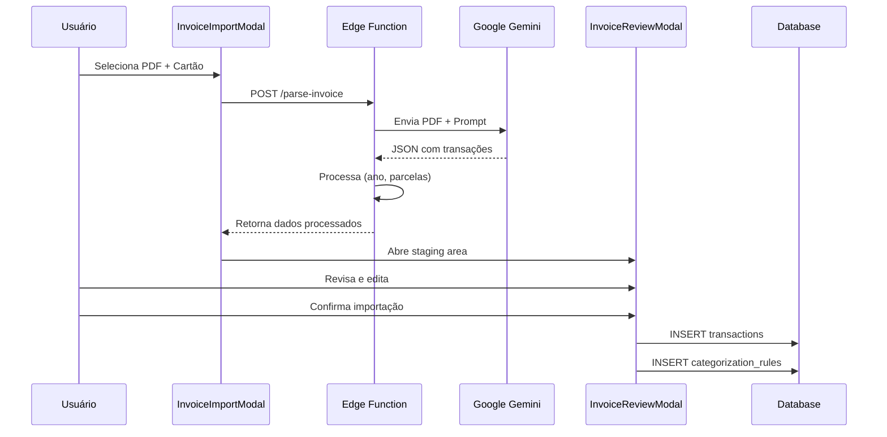
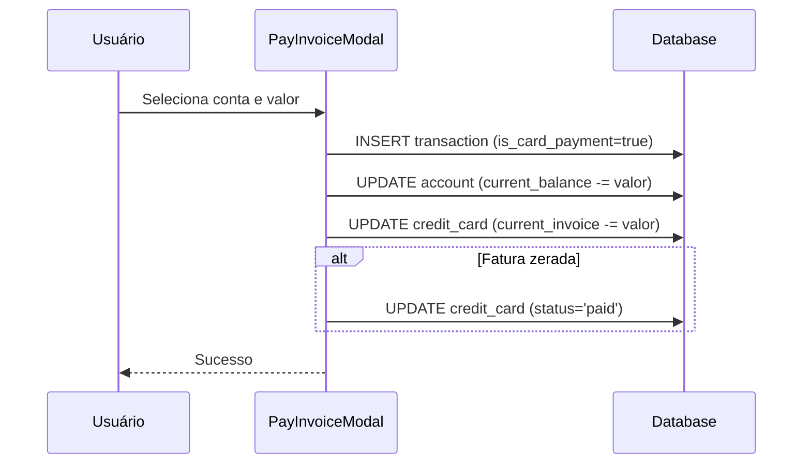
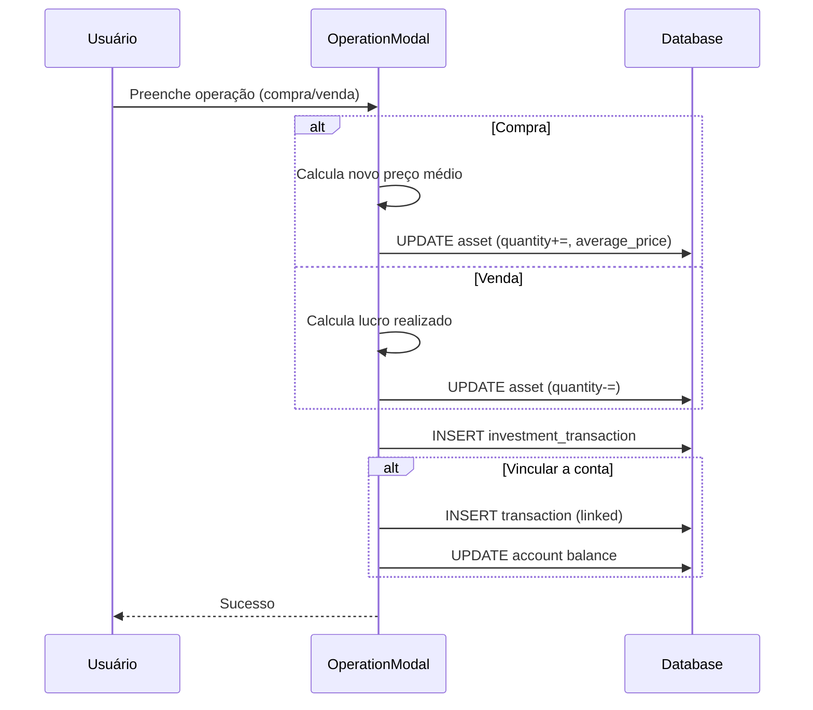

# Sistema de Gestão Financeira Pessoal

## Documentação Técnica Completa

> **Última atualização:** Janeiro 2025  
> Este documento serve como referência para desenvolvedores e para a IA em tarefas complexas futuras.

---

## 1. Visão Geral do Sistema

### 1.1 Informações Básicas

| Aspecto | Detalhes |
|---------|----------|
| **Nome** | Sistema de Gestão Financeira Pessoal (LaFinanceiro) |
| **Tipo** | Web App Mobile-First |
| **URL de Produção** | https://lafinaceiro.lovable.app |

### 1.2 Tech Stack

| Camada | Tecnologia |
|--------|------------|
| **Frontend** | React 18 + Vite + TypeScript |
| **Estilização** | Tailwind CSS + shadcn/ui + Radix UI |
| **State Management** | TanStack React Query v5 |
| **Backend** | Lovable Cloud (Supabase) |
| **Banco de Dados** | PostgreSQL (via Supabase) |
| **Autenticação** | Supabase Auth (email/password) |
| **Storage** | Supabase Storage (bucket privado) |
| **Edge Functions** | Deno (Supabase Edge Functions) |
| **AI/OCR** | Google Gemini 2.5 Pro |
| **Tema** | next-themes (dark/light mode) |

### 1.3 Design System

- **Layout:** Cards brancos com bordas suaves e acentos coloridos
- **Navegação Desktop:** Sidebar colapsável à esquerda
- **Navegação Mobile:** Bottom Navigation Bar fixa
- **Componentes:** Baseados em Radix UI primitives via shadcn/ui
- **Cores:** Sistema de tokens semânticos HSL em `index.css`
- **Tipografia:** Sistema font-family padrão do Tailwind

---

## 2. Estrutura de Banco de Dados (Schema)

### 2.1 Tabela `transactions`

Tabela central que armazena todas as movimentações financeiras.

| Campo | Tipo | Nullable | Default | Descrição |
|-------|------|----------|---------|-----------|
| `id` | UUID | Não | `gen_random_uuid()` | Identificador único |
| `user_id` | UUID | Não | - | Proprietário da transação |
| `account_id` | UUID | Sim | - | Conta bancária associada |
| `credit_card_id` | UUID | Sim | - | Cartão de crédito associado |
| `category_id` | UUID | Sim | - | Categoria da transação |
| `description` | TEXT | Não | - | Descrição/nome do lançamento |
| `amount` | NUMERIC | Não | - | Valor da transação |
| `type` | TEXT | Não | - | Tipo: `expense`, `income` |
| `status` | TEXT | Não | `'completed'` | Status: `completed`, `pending` |
| `date` | DATE | Não | `CURRENT_DATE` | **Data da compra (imutável)** |
| `due_date` | DATE | Sim | - | **Data de vencimento/competência da fatura** |
| `imported_at` | TIMESTAMP | Sim | - | Data do upload/importação |
| `is_corporate_expense` | BOOLEAN | Não | `false` | Isola gastos corporativos |
| `is_reimbursable` | BOOLEAN | Não | `false` | Marca para reembolso diverso |
| `is_card_payment` | BOOLEAN | Sim | `false` | Identifica pagamento de fatura |
| `is_refund` | BOOLEAN | Não | `false` | Marca como estorno/reembolso |
| `refunded_transaction_id` | UUID | Sim | - | Referência à transação estornada |
| `installment_group_id` | UUID | Sim | - | **Agrupa parcelas de uma mesma compra** |
| `installment_number` | INTEGER | Sim | - | Número da parcela atual (ex: 3) |
| `total_installments` | INTEGER | Sim | - | Total de parcelas (ex: 10) |
| `reimbursement_status` | TEXT | Sim | `'pending'` | Status: `pending`, `requested`, `reimbursed` |

#### Campos Críticos - Explicação Detalhada

```
┌─────────────────────────────────────────────────────────────────┐
│ DATAS NA TRANSAÇÃO                                              │
├─────────────────────────────────────────────────────────────────┤
│ date (purchase_date)                                            │
│   → Data real da compra                                         │
│   → Imutável após criação                                       │
│   → Usado para histórico e relatórios                           │
│                                                                 │
│ due_date                                                        │
│   → Data de vencimento/competência                              │
│   → Para cartões: mês da fatura onde aparece                    │
│   → Usado para filtros do Dashboard                             │
│                                                                 │
│ imported_at                                                     │
│   → Timestamp do upload                                         │
│   → Usado para auditoria                                        │
└─────────────────────────────────────────────────────────────────┘
```

### 2.2 Tabela `credit_cards`

| Campo | Tipo | Descrição |
|-------|------|-----------|
| `id` | UUID | Identificador único |
| `user_id` | UUID | Proprietário |
| `name` | TEXT | Nome do cartão |
| `last_digits` | TEXT | Últimos 4 dígitos |
| `brand` | TEXT | Bandeira (Visa, Master, etc) |
| `credit_limit` | NUMERIC | Limite total |
| `current_invoice` | NUMERIC | Valor atual da fatura |
| `closing_date` | INTEGER | Dia do fechamento (1-31) |
| `due_date` | INTEGER | Dia do vencimento (1-31) |
| `color` | TEXT | Cor do gradiente CSS |
| `status` | TEXT | `open`, `closed`, `paid` |

### 2.3 Tabela `accounts`

| Campo | Tipo | Descrição |
|-------|------|-----------|
| `id` | UUID | Identificador único |
| `user_id` | UUID | Proprietário |
| `name` | TEXT | Nome da conta |
| `type` | TEXT | Tipo: `checking`, `savings`, `investment` |
| `current_balance` | NUMERIC | Saldo atual |
| `icon` | TEXT | Emoji do ícone |
| `color` | TEXT | Cor do gradiente CSS |

### 2.4 Tabela `categories`

Suporta hierarquia de dois níveis (categoria pai → subcategorias).

| Campo | Tipo | Descrição |
|-------|------|-----------|
| `id` | UUID | Identificador único |
| `user_id` | UUID | Proprietário |
| `name` | TEXT | Nome da categoria |
| `type` | TEXT | `expense` ou `income` |
| `parent_id` | UUID | Referência à categoria pai (null = categoria raiz) |
| `icon` | TEXT | Emoji do ícone |
| `color` | TEXT | Cor hexadecimal |

### 2.5 Tabela `categorization_rules`

Sistema de aprendizado para categorização automática.

| Campo | Tipo | Descrição |
|-------|------|-----------|
| `id` | UUID | Identificador único |
| `user_id` | UUID | Proprietário |
| `keyword` | TEXT | Palavra-chave para matching (case-insensitive) |
| `category_id` | UUID | Categoria a ser aplicada |
| `is_corporate` | BOOLEAN | Marca automaticamente como gasto corporativo |

### 2.6 Tabela `budgets`

| Campo | Tipo | Descrição |
|-------|------|-----------|
| `id` | UUID | Identificador único |
| `user_id` | UUID | Proprietário |
| `category_id` | UUID | Categoria do orçamento |
| `planned_amount` | NUMERIC | Valor planejado |
| `month` | INTEGER | Mês (1-12) |
| `year` | INTEGER | Ano |

### 2.7 Tabelas de Investimentos

#### `investment_institutions`

| Campo | Tipo | Descrição |
|-------|------|-----------|
| `id` | UUID | Identificador único |
| `user_id` | UUID | Proprietário |
| `name` | TEXT | Nome da instituição (XP, Rico, etc) |
| `icon` | TEXT | Emoji |
| `color` | TEXT | Cor |

#### `investment_assets`

| Campo | Tipo | Descrição |
|-------|------|-----------|
| `id` | UUID | Identificador único |
| `user_id` | UUID | Proprietário |
| `institution_id` | UUID | Instituição financeira |
| `name` | TEXT | Nome do ativo |
| `ticker` | TEXT | Código do ativo (PETR4, MXRF11) |
| `asset_type` | TEXT | `renda_fixa`, `renda_variavel`, `fiis`, `crypto`, `saldo_corretora` |
| `quantity` | NUMERIC | Quantidade de cotas/ações |
| `average_price` | NUMERIC | **Preço médio ponderado** |
| `current_price` | NUMERIC | Cotação atual |
| `maturity_date` | DATE | Data de vencimento (renda fixa) |

#### `investment_transactions`

| Campo | Tipo | Descrição |
|-------|------|-----------|
| `id` | UUID | Identificador único |
| `user_id` | UUID | Proprietário |
| `asset_id` | UUID | Ativo relacionado |
| `type` | TEXT | `buy`, `sell`, `dividend` |
| `quantity` | NUMERIC | Quantidade |
| `unit_price` | NUMERIC | Preço unitário |
| `fees` | NUMERIC | Taxas/corretagem |
| `total_value` | NUMERIC | Valor total |
| `date` | DATE | Data da operação |
| `realized_profit` | NUMERIC | Lucro realizado (vendas) |
| `linked_transaction_id` | UUID | Transação financeira vinculada |

### 2.8 Tabelas de Compartilhamento

#### `profiles`

| Campo | Tipo | Descrição |
|-------|------|-----------|
| `id` | UUID | Mesmo ID do auth.users |
| `email` | TEXT | Email do usuário |
| `full_name` | TEXT | Nome completo |
| `avatar_url` | TEXT | URL do avatar |

#### `shared_access`

| Campo | Tipo | Descrição |
|-------|------|-----------|
| `owner_id` | UUID | Usuário que compartilha |
| `shared_with_user_id` | UUID | Usuário que recebe acesso |

#### `invitations`

| Campo | Tipo | Descrição |
|-------|------|-----------|
| `owner_id` | UUID | Quem convida |
| `invited_email` | TEXT | Email do convidado |
| `invited_user_id` | UUID | ID após aceite |
| `status` | TEXT | `pending`, `accepted`, `rejected` |

---

## 3. Regras de Negócio Implementadas

### 3.1 Importação de Fatura de Cartão de Crédito

A importação é feita via Edge Function `parse-invoice` que utiliza Google Gemini 2.5 Pro para OCR.

#### Fluxo Completo

```
┌─────────────────────────────────────────────────────────────────┐
│ 1. UPLOAD DO PDF                                                │
│    └─> Usuário seleciona arquivo na InvoiceImportModal          │
│                                                                 │
│ 2. ENVIO PARA EDGE FUNCTION                                     │
│    └─> POST /parse-invoice com FormData (file, creditCardId)    │
│                                                                 │
│ 3. PROCESSAMENTO OCR (Gemini)                                   │
│    ├─> Extrai data de vencimento da fatura                      │
│    ├─> Extrai cada linha de transação                           │
│    └─> Retorna JSON estruturado                                 │
│                                                                 │
│ 4. PÓS-PROCESSAMENTO (Edge Function)                            │
│    ├─> Inferência de ano para compras antigas                   │
│    ├─> Detecção de parcelamentos (regex)                        │
│    ├─> Geração de parcelas futuras                              │
│    └─> Identificação de transações pós-fechamento               │
│                                                                 │
│ 5. STAGING AREA (InvoiceReviewModal)                            │
│    ├─> Usuário revisa cada transação                            │
│    ├─> Edita descrição, valor, categoria                        │
│    ├─> Marca como corporativo se necessário                     │
│    ├─> Cria regras de categorização                             │
│    └─> Decide incluir parcelas futuras                          │
│                                                                 │
│ 6. CONFIRMAÇÃO                                                  │
│    └─> Cria transações no banco com due_date correto            │
└─────────────────────────────────────────────────────────────────┘
```

#### Lógica de Inferência de Ano

```typescript
// Se o mês da compra é maior que o mês da fatura,
// a compra foi feita no ano anterior
if (purchaseMonth > invoiceMonth) {
  purchaseYear = invoiceYear - 1;
}

// Exemplo:
// Fatura: Janeiro 2025 (mês 1)
// Compra: 15 de Dezembro
// Resultado: 15/12/2024 (não 2025)
```

#### Detecção de Parcelamento

```typescript
// Padrões detectados pelo regex:
// "3/10", "PARC 3/10", "3 DE 10", "PARCELA 3/10"
const installmentPattern = /(?:PARC(?:ELA)?\.?\s*)?(\d{1,2})\s*[\/DE]\s*(\d{1,2})/i;

// Ao detectar "3/10":
// - installment_number = 3
// - total_installments = 10
// - Gera automaticamente parcelas 4 a 10 com due_date incrementado
```

#### Exclusão de Tabelas Futuras

O prompt do Gemini instrui explicitamente a ignorar seções como:
- "Compras parceladas - próximas faturas"
- "Lançamentos futuros"
- "Próximas parcelas"

Isso evita duplicidade de soma ao importar.

### 3.2 Conciliação Bancária e Pagamento de Fatura

#### Pagamento de Fatura do Cartão

```
┌─────────────────────────────────────────────────────────────────┐
│ REGRA: Pagamento de fatura NÃO é despesa!                       │
├─────────────────────────────────────────────────────────────────┤
│ 1. Transação marcada com is_card_payment = true                 │
│ 2. Tipo: expense (para debitar conta)                           │
│ 3. NÃO aparece em relatórios de despesas                        │
│ 4. É uma TRANSFERÊNCIA: Conta → Cartão                          │
└─────────────────────────────────────────────────────────────────┘

Fluxo Atômico:
1. Cria transação na conta com is_card_payment = true
2. Debita current_balance da conta
3. Reduz current_invoice do cartão
4. Se current_invoice = 0, status = 'paid'
```

### 3.3 Tratamento de Reembolsos (Estornos)

```typescript
// Reembolso = Despesa Negativa
// Reduz o total de despesas da categoria original

// No Dashboard:
const expenseTotal = transactions
  .filter(t => t.type === 'expense' && !t.is_refund)
  .reduce((sum, t) => sum + t.amount, 0);

const refundTotal = transactions
  .filter(t => t.type === 'expense' && t.is_refund)
  .reduce((sum, t) => sum + t.amount, 0);

const netExpense = expenseTotal - refundTotal;
```

**Relatório Dedicado:** `RefundReport.tsx` mostra despesas líquidas por categoria após reembolsos.

### 3.4 Gastos Corporativos

```
┌─────────────────────────────────────────────────────────────────┐
│ GASTOS CORPORATIVOS (is_corporate_expense = true)               │
├─────────────────────────────────────────────────────────────────┤
│ ✗ NÃO somam nos relatórios de gastos pessoais                   │
│ ✓ SOMAM no total da fatura (para conferência)                   │
│ ✓ Aparecem em página dedicada: /corporate-expenses              │
│ ✓ Podem ser marcados automaticamente via categorization_rules   │
└─────────────────────────────────────────────────────────────────┘
```

### 3.5 Gastos Reembolsáveis (Diversos)

Diferente de corporativos, são gastos pessoais que serão reembolsados por terceiros.

```
Estados do reimbursement_status:
- pending: Aguardando solicitação
- requested: Solicitado ao pagador
- reimbursed: Já recebido

Página dedicada: /reimbursements
- Seleção em lote de transações
- Alteração de status em massa
- Exportação CSV para prestação de contas
```

### 3.6 Cálculo de Saldo

```typescript
// Saldo = Soma dos saldos das contas
// NÃO inclui faturas de cartão (são passivos, não ativos)

const totalBalance = accounts.reduce((sum, account) => 
  sum + account.current_balance, 0
);
```

---

## 4. Funcionalidades de Interface (UX)

### 4.1 Dashboard

#### Cards de Resumo
1. **Saldo Total:** Soma dos saldos de todas as contas
2. **Receitas:** Total de entradas do mês (exceto reembolsos)
3. **Despesas:** Total de saídas (exceto corporativas, reembolsáveis, pagamentos de cartão)
4. **Faturas:** Soma das faturas abertas de todos os cartões

#### Gráficos
- **Pizza de Despesas:** Clique em fatia abre Sheet com detalhes da categoria
- **Pizza de Receitas:** Mesmo comportamento
- **Gráfico de Saldo:** Evolução do saldo ao longo do mês

#### Filtro de Visualização
```
[ Meus Gastos ] [ Corporativo ] [ Reembolsável ]
```
Alterna a visualização entre os diferentes tipos de despesa.

#### Lista "Top 4"
Em vez de legendas poluídas no gráfico, mostra as 4 principais categorias em lista.

### 4.2 Mobile Experience

```
┌─────────────────────────────────────────────────────────────────┐
│ ADAPTAÇÕES MOBILE                                               │
├─────────────────────────────────────────────────────────────────┤
│ • Bottom Navigation Bar (detectado via use-mobile hook)         │
│ • Tabelas convertidas em Cards empilhados                       │
│ • Inputs numéricos: inputMode="decimal"                         │
│ • Modais substituídos por Sheets/Drawers (deslizam de baixo)    │
│ • Touch-friendly: botões maiores, áreas de toque adequadas      │
└─────────────────────────────────────────────────────────────────┘
```

### 4.3 Staging Area de Importação

O `InvoiceReviewModal` funciona como área de preparação:

```
Para cada transação importada:
┌────────────────────────────────────────────────────────┐
│ [✓] Incluir                                            │
│                                                        │
│ Descrição: [NETFLIX                    ] ← Editável    │
│ Valor:     [R$ 39,90                   ] ← Editável    │
│ Categoria: [Lazer > Streaming        ▼] ← Seletor     │
│                                                        │
│ [✓] Gasto Corporativo                                  │
│ [✓] Lembrar regra: [NETFLIX           ] ← Keyword     │
│ [ ] Incluir parcelas futuras (3 de 10)                 │
│                                                        │
│ ⚠️ Transação pós-fechamento (cairá na próxima fatura)  │
└────────────────────────────────────────────────────────┘
```

### 4.4 Criação de Categorias Inline

Na própria modal de importação ou transação:
1. Usuário clica em "Nova Categoria"
2. Modal aninhada abre para criar categoria pai
3. Opção de criar subcategoria com seletor de pai
4. Categoria criada já aparece selecionada

### 4.5 Regras de Categorização

Página `/categorization-rules`:
- Tabela com todas as regras do usuário
- Preview antes de aplicar em lote
- Aplicação em transações sem categoria
- Edição e exclusão de regras existentes

---

## 5. Módulo de Investimentos

### 5.1 Funcionalidades

| Feature | Descrição |
|---------|-----------|
| **CRUD de Ativos** | Cadastro por tipo (RF, RV, FIIs, Crypto, Saldo) |
| **Operações** | Registro de compra, venda, dividendos |
| **Preço Médio** | Cálculo automático ponderado |
| **Cotações** | Atualização manual em massa |
| **Instituições** | Organização por corretora |

### 5.2 Dashboard de Investimentos

#### Cards de Resumo
1. **Patrimônio:** Σ(quantity × current_price)
2. **Aplicado:** Σ(quantity × average_price)
3. **Resultado R$:** Patrimônio - Aplicado
4. **Resultado %:** (Resultado / Aplicado) × 100

#### Visualizações
- **Donut Chart:** Alocação por tipo de ativo
- **Lista de Instituições:** Patrimônio por corretora
- **Tabela de Ativos:** Performance individual
- **Histórico:** Últimas operações

### 5.3 Cálculos Implementados

```typescript
// Preço Médio na Compra
const currentTotal = asset.quantity * asset.average_price;
const purchaseTotal = newQuantity * purchasePrice;
const newQuantity = asset.quantity + purchaseQuantity;
const newAveragePrice = (currentTotal + purchaseTotal) / newQuantity;

// Na Venda: preço médio não muda, apenas quantidade
// Lucro Realizado = (precoVenda - precoMedio) × quantidade

// Dividendos: registra como operação, pode vincular a transação de receita
```

---

## 6. Segurança

### 6.1 Row Level Security (RLS)

**Ativado em TODAS as tabelas** com política padrão:

```sql
-- Política básica
CREATE POLICY "Users can view own data"
ON public.table_name
FOR SELECT
USING (auth.uid() = user_id);

-- Com compartilhamento
CREATE POLICY "Users can view own or shared data"
ON public.table_name
FOR SELECT
USING (
  auth.uid() = user_id 
  OR EXISTS (
    SELECT 1 FROM shared_access
    WHERE shared_with_user_id = auth.uid()
    AND owner_id = table_name.user_id
  )
);
```

### 6.2 Storage

```
Bucket: documents
├── Visibilidade: PRIVADO
├── Políticas: Apenas owner pode upload/download
└── Uso: Armazenamento de PDFs de faturas
```

### 6.3 Edge Functions

| Aspecto | Implementação |
|---------|---------------|
| **Autenticação** | JWT token validado em todas as requests |
| **CORS** | Headers configurados para origem do app |
| **Secrets** | Gerenciados via Supabase Secrets |

Secrets configurados:
- `GOOGLE_AI_API_KEY` - API do Gemini
- `SUPABASE_SERVICE_ROLE_KEY` - Operações privilegiadas
- `SUPABASE_URL` - URL do projeto
- `SUPABASE_ANON_KEY` - Chave pública

### 6.4 Autenticação

```
Fluxo:
1. /auth - Login/Signup com email e senha
2. Auto-confirm email HABILITADO (não requer verificação)
3. /forgot-password - Solicita reset
4. /reset-password - Define nova senha

Proteção de Rotas:
- AuthContext verifica sessão
- Rotas protegidas redirecionam para /auth
- Session refresh automático
```

---

## 7. Estrutura de Arquivos

```
projeto/
├── src/
│   ├── components/
│   │   ├── layout/
│   │   │   ├── AppSidebar.tsx      # Navegação lateral
│   │   │   ├── Header.tsx          # Cabeçalho com seletor de mês
│   │   │   └── MainLayout.tsx      # Layout principal
│   │   │
│   │   ├── modals/
│   │   │   ├── AccountModal.tsx
│   │   │   ├── AccountImportModal.tsx    # Import OFX/CSV
│   │   │   ├── AccountReviewModal.tsx    # Staging extrato
│   │   │   ├── CreditCardModal.tsx
│   │   │   ├── InvoiceImportModal.tsx    # Upload PDF fatura
│   │   │   ├── InvoiceReviewModal.tsx    # Staging fatura
│   │   │   ├── PayInvoiceModal.tsx       # Pagamento de fatura
│   │   │   ├── TransactionModal.tsx
│   │   │   ├── TransactionFiltersModal.tsx
│   │   │   ├── NewBudgetModal.tsx
│   │   │   ├── EditBudgetModal.tsx
│   │   │   ├── AddSubcategoryModal.tsx
│   │   │   └── DeleteCategoryModal.tsx
│   │   │
│   │   ├── dashboard/
│   │   │   ├── SummaryCard.tsx
│   │   │   ├── CategoryChart.tsx
│   │   │   ├── BalanceChart.tsx
│   │   │   ├── BudgetEvolutionChart.tsx
│   │   │   ├── AllCategoriesList.tsx
│   │   │   ├── CategoryDetailSheet.tsx
│   │   │   └── ParentCategoryDetailSheet.tsx
│   │   │
│   │   ├── investments/
│   │   │   ├── InvestmentSummaryCards.tsx
│   │   │   ├── AllocationChart.tsx
│   │   │   ├── AssetTable.tsx
│   │   │   ├── AssetModal.tsx
│   │   │   ├── OperationModal.tsx
│   │   │   ├── UpdatePricesModal.tsx
│   │   │   ├── InstitutionsList.tsx
│   │   │   ├── InstitutionModal.tsx
│   │   │   └── TransactionHistory.tsx
│   │   │
│   │   ├── credit-cards/
│   │   │   ├── InstallmentsDashboard.tsx
│   │   │   ├── ReconciliationCard.tsx
│   │   │   └── ReconciliationDetailModal.tsx
│   │   │
│   │   ├── reports/
│   │   │   └── RefundReport.tsx
│   │   │
│   │   ├── settings/
│   │   │   ├── MembersSection.tsx
│   │   │   └── InstallmentMigration.tsx
│   │   │
│   │   └── ui/                    # shadcn/ui components
│   │
│   ├── pages/
│   │   ├── Dashboard.tsx          # Página principal
│   │   ├── Transactions.tsx       # Lista de transações
│   │   ├── Accounts.tsx           # Contas bancárias
│   │   ├── CreditCards.tsx        # Cartões de crédito
│   │   ├── Categories.tsx         # Gerenciamento de categorias
│   │   ├── CategorizationRules.tsx
│   │   ├── Investments.tsx        # Investimentos
│   │   ├── Planning.tsx           # Orçamentos
│   │   ├── Reports.tsx            # Relatórios
│   │   ├── CorporateExpenses.tsx  # Gastos corporativos
│   │   ├── Reimbursements.tsx     # Gastos reembolsáveis
│   │   ├── Settings.tsx           # Configurações
│   │   ├── Auth.tsx               # Login/Signup
│   │   ├── ForgotPassword.tsx
│   │   ├── ResetPassword.tsx
│   │   └── NotFound.tsx
│   │
│   ├── hooks/
│   │   ├── useTransactions.ts     # CRUD transações
│   │   ├── useAccounts.ts         # CRUD contas
│   │   ├── useCreditCards.ts      # CRUD cartões
│   │   ├── useCategories.ts       # CRUD categorias
│   │   ├── useBudgets.ts          # CRUD orçamentos
│   │   ├── useInvestments.ts      # CRUD investimentos
│   │   ├── useInstitutions.ts     # CRUD instituições
│   │   ├── useCategorizationRules.ts
│   │   ├── useCreditCardReconciliation.ts
│   │   ├── useCreditCardTransactions.ts
│   │   ├── useInstallmentGroup.ts
│   │   ├── usePendingInstallments.ts
│   │   ├── useInvitations.ts
│   │   └── use-mobile.tsx         # Detecção mobile
│   │
│   ├── contexts/
│   │   ├── AuthContext.tsx        # Estado de autenticação
│   │   └── DateContext.tsx        # Mês/ano selecionado
│   │
│   ├── lib/
│   │   ├── utils.ts               # Utilitários (cn, formatCurrency)
│   │   ├── csvParser.ts           # Parser de CSV bancário
│   │   ├── ofxParser.ts           # Parser de OFX
│   │   ├── bankConfig.ts          # Configurações por banco
│   │   └── errorHandler.ts        # Tratamento de erros
│   │
│   └── integrations/
│       └── supabase/
│           ├── client.ts          # Cliente Supabase (auto-gerado)
│           └── types.ts           # Tipos do banco (auto-gerado)
│
├── supabase/
│   ├── config.toml                # Configuração do projeto
│   └── functions/
│       ├── parse-invoice/         # OCR de faturas
│       │   └── index.ts
│       └── migrate-installments/  # Migração de parcelamentos
│           └── index.ts
│
└── public/
    ├── favicon.ico
    ├── robots.txt
    └── placeholder.svg
```

---

## 8. Fluxos Críticos

### 8.1 Importação de Fatura PDF



### 8.2 Pagamento de Fatura



### 8.3 Registro de Operação de Investimento



---

## 9. Convenções de Código

### 9.1 Nomenclatura

| Tipo | Convenção | Exemplo |
|------|-----------|---------|
| Componentes | PascalCase | `TransactionModal.tsx` |
| Hooks | camelCase com prefixo "use" | `useTransactions.ts` |
| Utilitários | camelCase | `formatCurrency()` |
| Tipos/Interfaces | PascalCase | `Transaction`, `CategoryData` |
| Constantes | UPPER_SNAKE_CASE | `DEFAULT_PAGE_SIZE` |

### 9.2 Estrutura de Componente

```tsx
// Imports organizados: React, libs, componentes, hooks, utils, types
import { useState } from 'react';
import { useQuery } from '@tanstack/react-query';
import { Button } from '@/components/ui/button';
import { useTransactions } from '@/hooks/useTransactions';
import { formatCurrency } from '@/lib/utils';
import type { Transaction } from '@/types';

// Interface de props no topo
interface ComponentProps {
  onClose: () => void;
}

// Componente exportado
export const Component = ({ onClose }: ComponentProps) => {
  // Estado local
  const [isOpen, setIsOpen] = useState(false);
  
  // Hooks customizados
  const { data, isLoading } = useTransactions();
  
  // Handlers
  const handleSubmit = () => { /* ... */ };
  
  // Render
  return (/* JSX */);
};
```

### 9.3 Padrões de Query

```tsx
// Queries com React Query
const { data, isLoading, error } = useQuery({
  queryKey: ['transactions', month, year],
  queryFn: () => fetchTransactions(month, year),
});

// Mutations com invalidação
const mutation = useMutation({
  mutationFn: createTransaction,
  onSuccess: () => {
    queryClient.invalidateQueries({ queryKey: ['transactions'] });
    toast({ title: 'Sucesso!' });
  },
});
```

---

## 10. Troubleshooting

### Problema: Dados não aparecem após importação
**Causa:** Filtro de data não inclui o mês da transação
**Solução:** Verificar `due_date` vs `date` e o mês selecionado no Header

### Problema: Soma da fatura difere do PDF
**Causa:** Tabela de "lançamentos futuros" foi incluída
**Solução:** Verificar se o parser está ignorando seções corretas

### Problema: Parcelas não aparecem agrupadas
**Causa:** `installment_group_id` não foi preenchido
**Solução:** Rodar migração `migrate-installments` ou verificar importação

### Problema: Transação aparece em relatório errado
**Causa:** Flags incorretos (`is_corporate_expense`, `is_reimbursable`, `is_card_payment`)
**Solução:** Editar transação e corrigir flags

---

## 11. Próximos Passos Sugeridos

1. **Importação de Extrato Bancário**
   - Suporte a mais formatos (CSV, OFX)
   - Conciliação automática com faturas

2. **Metas Financeiras**
   - Definir objetivos de economia
   - Acompanhamento de progresso

3. **Relatórios Avançados**
   - Comparativo mensal/anual
   - Projeções de gastos

4. **Integração com APIs**
   - Cotações automáticas de ativos
   - Sync com bancos via Open Banking

5. **PWA**
   - Funcionamento offline
   - Push notifications

---

> **Nota:** Este documento deve ser atualizado sempre que houver mudanças significativas no sistema.
